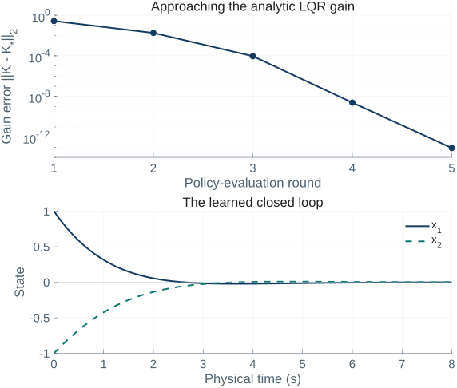
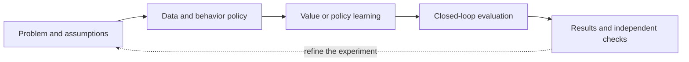

# ADP-MATLAB

[Project page](https://tanjunkai2001.github.io/projects/adp-matlab/) · [v0.5.2](https://github.com/tanjunkai2001/adp-matlab/releases/tag/v0.5.2) · [CI](https://github.com/tanjunkai2001/adp-matlab/actions/workflows/checks.yml) · [MIT](LICENSE)

**MATLAB reference implementations and reproducible experiments for adaptive dynamic programming control.**

[中文说明](README.zh-CN.md) · [Quick start](docs/GETTING_STARTED.md) · [Methods](docs/METHODS.md) · [Validation](VALIDATION.md) · [Roadmap](docs/ROADMAP.md)

Learn from a small integral policy-iteration example, then explore Koopman models, neural HJB solvers, mean-field control and recent control-journal methods. Each implementation connects its equations, MATLAB functions, assumptions and recorded outcomes.

<!-- SNAPSHOT:START -->
**v0.5.2:** 8 runnable entries · 7 paper packages · 104/104 local tests passed · 6 research skills. Tested on 25.2.0.3312555 (R2025b) Update 6 (MACA64).
<!-- SNAPSHOT:END -->

<p align="center"></p>

The figure is generated from an actual run of the double-integrator example. Its [CSV data and settings](docs/assets/data) accompany the source.

## Start here

Clone this repository or extract a source ZIP, then open its root folder in MATLAB. The baseline needs base MATLAB with the standard JVM.

```sh
git clone https://github.com/tanjunkai2001/adp-matlab.git
cd adp-matlab
```

```matlab
check_environment();
demo_reproductions();

[result, runDir] = demo_reproductions('baseline');
result.learning.K                % Reference: [1, sqrt(3)]
run_tests;
```

To inspect or execute all local tests:

```matlab
run_all_tests('list');
results = run_all_tests;
```

The full suite uses **Control System Toolbox** and **Deep Learning Toolbox**. One PINN replay test performs two single Adam updates; a Safe PINN persistence test evaluates its demo with zero updates. Complete neural training is invoked separately. See [installation and examples](docs/GETTING_STARTED.md) for the full workflow.

## Implemented methods

<!-- METHODS:START -->
| Method / source | Model & learning | Tests | Implemented scope |
|---|---|---:|---|
| [Integral policy iteration](docs/GETTING_STARTED.md) · Reference baseline | CT linear quadratic · known B | 46 | Analytic LQR comparator; two-state example. |
| [Koopman generator + PI](reproductions/koopman_l4dc2025) · [L4DC 2025](https://proceedings.mlr.press/v283/zeng25a.html) | CT nonlinear · identified generator | 8 | Normalized pendulum variant; not every paper table. |
| [Mean-field LQG](reproductions/meanfield_lqg2025) · [Automatica 2025](https://doi.org/10.1016/j.automatica.2024.111924) | Stochastic CT · two-gain PI | 8 | Finite-sample social optimization; low-sample failures retained. |
| [Off-policy Q-learning](reproductions/qlearning_tac2023) · [IEEE TAC 2023](https://doi.org/10.1109/TAC.2023.3235967) | DT LQR · matrix Bellman equation | 7 | Data-based LQR; explicit MIMO initialization variant. |
| [Infinite-horizon HJB PINN](reproductions/pinn_infinite_horizon2025) · [IJRNC 2025](https://doi.org/10.1002/rnc.70028) | Neural HJB · horizon continuation | 5 | Reduced LQR/pendulum training; corrected quartic cost identified. |
| [Safe epigraph PINN](reproductions/safe_pinn_icml2025) · [ICML 2025](https://proceedings.mlr.press/v267/tayal25a.html) | Epigraph HJB · neural value | 10 | Boat example; collision and budget violations remain. |
| [Robust Koopman PI](reproductions/robust_koopman2026) · [Preprint 2026](https://arxiv.org/abs/2604.05633) | Lifted bilinear · robust PI | 8 | Held-out error bound fails on 25.55% of points. |
| [Bias-policy iteration](reproductions/bias_pi_automatica2026) · [Automatica 2026](https://doi.org/10.1016/j.automatica.2026.112821) | Unknown CT nonlinear · fixed data | 12 | Pendulum/arm variants; arm cost is 8.84% above local LQR. |
<!-- METHODS:END -->

The method names link to their MATLAB packages. The source papers are credited individually. A passing test is a code-level result; numerical reproduction scope appears in the final column and in each paper card.

## What the repository provides

| Part | Use it for |
|---|---|
| [`src/+adp`](src/+adp) | Small shared MATLAB functions for models, features, integral PI, simulation and result storage. |
| [`reproductions`](reproductions) | Direct functions for each paper, with its native mathematical and data conventions. |
| [`docs/fulltext`](docs/fulltext) | Source versions, equation maps, assumptions and differences from the papers. |
| [`registry`](registry) | The method, paper, dependency and implementation-status inventory. |
| [`templates`](templates) | Starting a method intake, equation map and experiment record. |
| [`.agents/skills`](.agents/skills) | Six optional research workflows for coding, reproduction, theory, safety, benchmarks and Simulink. |



The paper packages retain direct functions. Shared code is extracted when multiple methods use the same mathematical contract. New runs are saved separately from historical records.

## Reproduction evidence

- The baseline is checked against an analytic LQR solution.
- Paper packages include independent equation, derivative, integration and numerical checks.
- Safe-PINN collision/budget violations, robust-Koopman bound failures and Bias-PI performance limitations are retained in the [validation record](VALIDATION.md).
- Detailed historical runs belong in versioned [artifact bundles](docs/ARTIFACTS.md), keeping the source checkout small.

The three original upstream sources—[Frank Lewis’s software](https://lewisgroup.uta.edu/code/Software%20from%20Research.htm), [FxT-CL-ACI](https://github.com/tanjunkai2001/FxT-CL-ACI), and [Adaptive-dynamic-programming-algorithms](https://github.com/lujingweihh/Adaptive-dynamic-programming-algorithms)—are acknowledged in [THIRD_PARTY](THIRD_PARTY.md). Their complete legacy simulations have not yet been migrated here.

## Contribute

Good first contributions include an independent cross-version run, a clearer equation map, a reproducible bug report, or one complete method with an independent comparator. Read [CONTRIBUTING](CONTRIBUTING.md) before adding an implementation.

The next priorities are **FxT-CL-ACI**, **one constrained execution example**, and **one MATLAB/Simulink robot example**. See the [roadmap and acceptance criteria](docs/ROADMAP.md).

## Citation and license

Use [CITATION.cff](CITATION.cff) for the software metadata and cite the original paper for each method you use. Record the software version or commit in an experiment report. No software DOI has been assigned.

The independently written software and project documentation are released under the [MIT License](LICENSE). Paper PDFs, upstream source archives and author checkpoints are not bundled and retain their own terms. See [THIRD_PARTY](THIRD_PARTY.md) for the source and adapter attributions.

Maintained by [Junkai Tan](https://tanjunkai2001.github.io/).
